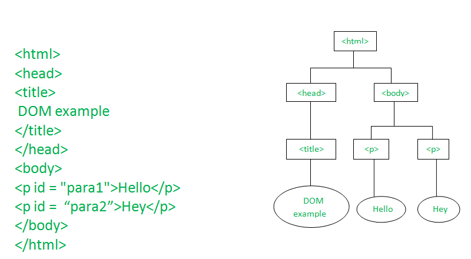

# DOM
## Document Object Model

A standard for how to get, change, add, or delete HTML Element.

## What to expect ?
- Quick introduction to DOM.
- How the DOM represents the HTML documents in memory.
- How to use APIs to create web content and application.

**Javascript makes the HTML page active and dynamic via DOM**

## What is DOM ?
- A programming inteface for web documents.
- DOM is not a programming language.
- DOM represents the page so that programs can change  the document structure, style and content.
- DOM represents the document as **nodes and Objects**

## DOM Example



## How to manipulate DOM ?

- **Using javascript api's we can manipulate DOM object. Some of them are**

- createElement
- appendChild
- removeElement
- querySelector
- querySelectorAll
- insertBefore
- addEventListener
- removeEventListener
- removeChild
- replaceChild
- cloneNode
- setAttribute
- getAttribute
- removeAttribute


**Example**

```javascript
  const btn = document.createElement("button");
   const onClick = () => alert("clicked");
   btn.textContent = "Creating Node";
   document.body.appendChild(btn);
   btn.addEventListener("click", onClick);
   btn.setAttribute("disabled", true);
   btn.removeEventListener("click", onClick);
   document.body.removeChild(btn);
```

## Practical exercise

console.log(document) // display the document 

console.dir(document) // list all the document properties

document.title = "This is the DOM class"

document.body.style.backgroudColor = "gray"

**In the DOM manipulation exercise, there are many ways to manipulate the DOM, but we will just learn some common techniques which are enough to do our job.**

**Adding elements to the page**

## append , appendChild

const body = document.body;
body.append("Hello world", " Hi how are you");

- note append can append string and the node(html element)

body.appendChild(node)

**Create node** 

let div = document.createElement('div');

**Add text to the node**

div.textContent = "This is div"

or

div.innerText = "This is text again"


**append node**

body.append(div)

or

body.appendChild(div)


**Render html in any node**

div.innerHTML ="<h1>This is em tag</h1>"

Right way to add the html is create node first, add text and then appen.

const h1 = document.createElement('h1')
h1.textContent = "This is heading one"
div.append(h1)

**methods to select the html element**
- document.getElementById("demo");

- document.getElementsByClassName("hero");

- document.querySelector("#demo")
- document.querySelector(".hero")
- document.querySelector("div")

getAttribute, 

let demo = document.querySelector("#demo")

console.log(demo.getAttribute("id"))

or

console.log(demo.id)

**setAttribute**

demo.setAttribute("class", "hero")

demo.class = "new classname"

demo.removeAttribute("class")


