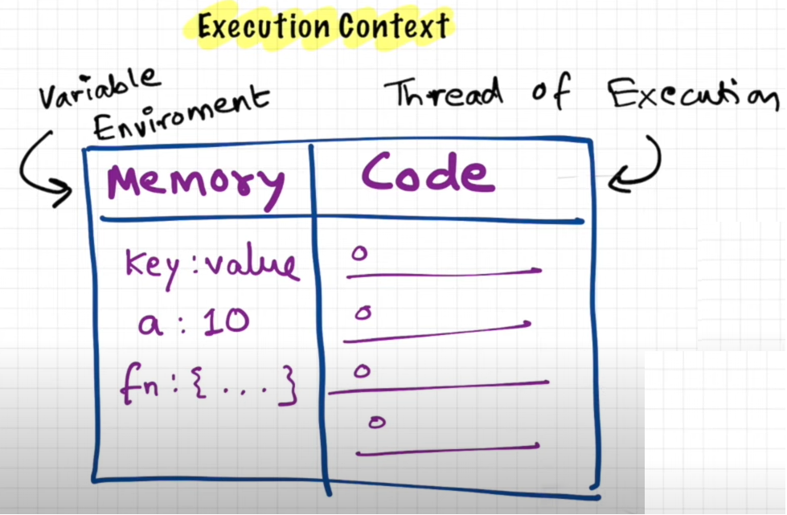
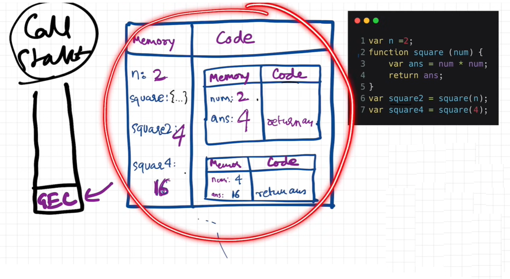
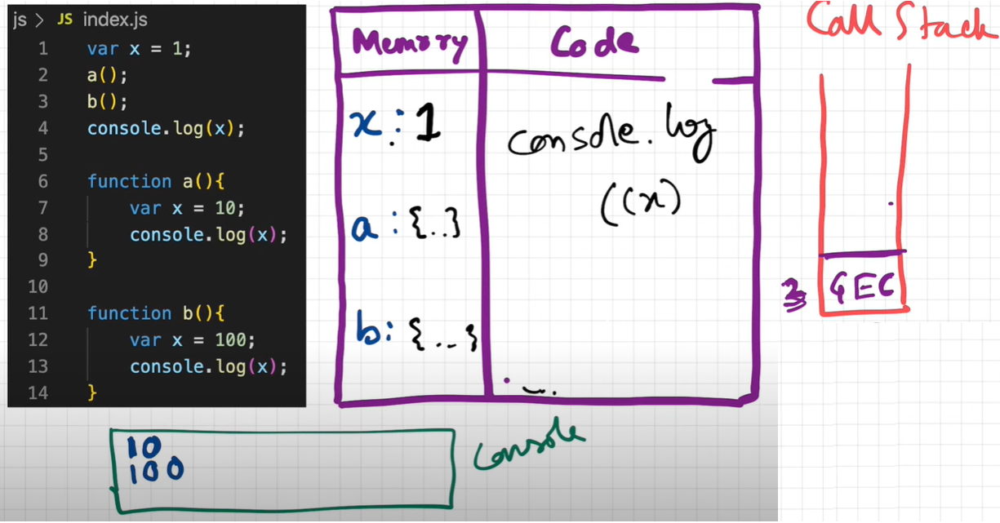

# JavaScript

- JS Basic
- DOM
- JS asynchronous
- Advance concept
- OOPS in js
- Projects

# Video (class recording and offline video)

1. [Data-types and operators](https://youtu.be/uxIxeAIxBhk)

2. [class-2](https://youtu.be/8v3mxQRboqE)

3. [class-3](https://youtu.be/71EepQCWd0c)

4. [class-4-function](https://youtu.be/sAE106lp_X4)

5. [class-5-function](https://youtu.be/qG0n6AfIiLg)

6. [class-6-A_Loops](https://youtu.be/Bp9WBhneHk0)

7. [class-7-A&B_Loops](https://youtu.be/SxhjO2Hwy3g)

8. [class-8-B&C_Loops](https://youtu.be/Pv-1WlHDfa4)

9. [class-9-Array](https://youtu.be/ZvtUqBNAJdU)

10. [class-10-Array-AB](https://youtu.be/pP-r0Ifk7xY)

11. [class-10-Array-C](https://youtu.be/8nssSSWNm3A)

12. [class-11-Nested_Array-A](https://youtu.be/S6j6ppffi-s)

13. [class-12-Nested_Array-B & C](https://youtu.be/3qVvEWgAXCw)

14. [class-13-JS-Object](https://youtu.be/zFsk3191J1k)

14. [class-14-JS-Object](https://youtu.be/QF0sipnF3D8)

15. [class-15-JS-Object](https://youtu.be/JyO-gcEDg0s)

16. [class-16-A_decomposing_problems](https://youtu.be/dmp5n3_MvVE)

17. [Javascript revision](https://youtu.be/WKIV07RBC8g)

18. [class-18-B_decomposing_problems](https://youtu.be/5ehab3Eb0CY)

19. [class-19-C_decomposing_problems](https://youtu.be/aZEYfif3Fyo)

## Projects Video

1. [Todo App](https://youtu.be/HpSeT2rzlnY)


**JavaScript basic to advance**

Welcome to JavaScript. JavaScript is the language of the web. I enjoy using and teaching JavaScript and I hope you will do so too.

In this step by step JavaScript challenge, you will learn JavaScript, the most popular programming language in the history of mankind.
JavaScript is used **_to add interactivity to websites, to develop mobile apps, desktop applications, games_** and nowadays JavaScript can be used for **_machine learning_** and **_AI_**.
**_JavaScript (JS)_** has increased in popularity in recent years and has been the leading programming language for six consecutive years and is the most used programming language on Github.

**complete these problems**

**[JavaScript Basic Practice Lession](https://github.com/dev1980/javascript-practice-exercises)**

# JavaScript Advance concept.

## How JavaScript Works & Execution Context

Everything in javascript happen inside Execution context. Just assume that EC is a big container where code execute.
So in EC two things happen, a. Memory creation and b. Code execution
Memory creation is also known as Variable Environment and Code execution is also called as thread of execution.
JavaScript is synchronous single-threaded programming language.


## How JavaScript Code is executed? & Call Stack

Once the memory creation phase is complete the code execute line by line.
As soon as javascript program run global execution context is created.
It has two phase, memory phase. It create memory for function and variable in global scope.



## Hoisting in JavaScript (variables & functions)

Hoisting in javascript is the phenomenon where variables and function memory location is created first before the execution of any code. In case of variable value is stored as undefined and for function, the function definition is stored.
This is the reason we have access to the variable and function even before the value is assigned .

- let's understand the below code. we are trying to access the varaible and function before value is assigned.
  In case of function it log Robert Welker and log x print undefined. this phenoman is happend becuase of hoisting.

```
getName()
console.log(x);

var x = 10;

function getName() {
    console.log("Robert Welker")
}

```

## How functions work in JS & Variable Environment

GEC - Global Execution context is created. Then that move to call stack soon the code run.

GEC contain the memory space of variable and function from our code.

Once code start running, it will assign the value to the variables step by step as the control move to that location.

For function there is new execution context is created. And push the call stack, once the value is returned from the function the function execution context is also deleted from the call stack.



## Function

What is an anonymous function ?

What is difference between function Statement vs Function Expression vs Function Declaration ?

The main difference between function statement and function expression is the Hoisting.

## First class function ?

`First-Class Function:` A programming language is said to have First-class functions if functions in that language are treated like other variables. So the functions can be assigned to any other variable or passed as an argument or can be returned by another function.
JavaScript treat function as a first-class-citizens. This means that functions are simply a value and are just another type of object.

```
const Arithmetics = {
	add:(a, b) => {
		return `${a} + ${b} = ${a+b}`;
	},
	subtract:(a, b) => {
		return `${a} - ${b} = ${a-b}`
	},
	multiply:(a, b) => {
		return `${a} * ${b} = ${a*b}`
	},
	division:(a, b) => {
		if(b!=0) return `${a} / ${b} = ${a/b}`;
		return `Cannot Divide by Zero!!!`;
	}

}

console.log(Arithmetics.add(100, 100));
console.log(Arithmetics.subtract(100, 7));
console.log(Arithmetics.multiply(5, 5));
console.log(Arithmetics.division(100, 5));


```

## What is Higher-Order Functions in Functional Programming ?

In Javascript, functions can be assigned to variables in the same way that strings or arrays can. They can be passed into other functions as parameters or returned from them as well. A “higher-order function” is a function that accepts functions as parameters and/or returns a function.

```
//find the area,  circumference and diameter from the given array of radius.
//Formula:
//area - PI*r*r
//circumference - 2*PI*r
//diameter - 2 * r

//Write a function calculateArea, calculateCircumference, calculateDiameter.


const radius =[2,5,3,4,6];


function area(r) {
  return Math.PI * r * r;
}

function circumference(r) {
  return 2 * Math.PI * r;
}

function diameter(r) {
  return 2 * r;
}

function calculate(radius, logic) {
  let area = [];
  for (let i = 0; i < radius.length; i++) {
    area.push(logic(radius[i]));
  }
  return area;
}

console.log(calculate(radius, area));
console.log(calculate(radius, circumference));
console.log(calculate(radius, diameter));

```

## map, filter & reduce

```
let radius = [2, 3, 4, 5];

let result = radius.map(function (r) {
  return r * 2;
});

console.log(result);

const output = radius.filter(function (num) {
  return num % 2 === 0;
});

console.log(output);

// sum , larger number

let sum = radius.reduce((acc, val) => {
  acc = acc + val;
  return acc;
}, 0);

console.log(sum);

```

- function statement or function decleration
- function expression
- arrow function - es6

```

// function statement or function decleration

a();

function a() {
  console.log('function statement');
}

a();

// function expression

const b = function () {
  console.log('function expression');
};

// b();

function c(callback) {
  callback();
}

c(b);
// What is the difference between function statement and expression  - Hoisting

// function are first class citizen -  because we can use function as value,

// Higher order function - when a function is passed as value then it call call back function and fuction receiving value is call higher order function. c is higher order function and b is call  back function.

// arrow function - es6

const area = () => {
  let num = 20;

  return 20 * 5;
};

console.log(area());

// map, filter, reduce ( higher order function)

```

# todo-app

```
// index.html

<!DOCTYPE html>
<html lang="en">
  <head>
    <meta charset="UTF-8" />
    <meta http-equiv="X-UA-Compatible" content="IE=edge" />
    <meta name="viewport" content="width=device-width, initial-scale=1.0" />
    <title>Things todo</title>
  </head>
  <body>
    <h1>Things to do</h1>
    <div class="todo">
    <input type="text" id="title" placeholder="enter todo" />
    <input type="date" id="date" />
    <button id="btn">Add todo</button>
    </div>
    <hr />
    <div id="display"></div>
    <script src="./script.js"></script>
  </body>
</html>

// script.js


//MVC

// Model or data

//MVC

// Model or data

let todos;

let getData = JSON.parse(localStorage.getItem('todos'));
if (Array.isArray(getData) && getData.length > 0) {
  todos = getData;
} else {
  todos = [
    { title: 'let go for walk', date: '2023-03-22', id: 1 },
    { title: 'Go for shopping', date: '2023-03-22', id: 2 },
    { title: 'go for driving', date: '2023-03-22', id: 3 },
  ];
  saveToLocalStorage();
}

// controller

let btn = document.getElementById('btn');

btn.addEventListener('click', addTodo);

function saveToLocalStorage() {
  localStorage.setItem('todos', JSON.stringify(todos));
}

function addTodo() {
  let title = document.getElementById('title').value;
  let date = document.getElementById('date').value;
  let id = new Date().getTime();
  todos.push({ title, date, id });
  document.getElementById('title').value = '';
  document.getElementById('date').value = '';
  saveToLocalStorage();
  render();
}

function deleteTodo(e) {
  console.log(e);
  let deleteId = Number(e.target.id);
  console.log(deleteId);
  todos = todos.filter((todo) => {
    console.log(todo);
    return todo.id !== deleteId;
  });
  saveToLocalStorage();
  render();
}

let index;

function updateTodo(e) {
  let targetId = Number(e.target.id);

  todos.map((todo, i) => {
    if (todo.id === targetId) {
      index = i;
      document.getElementById('title').value = todo.title;
      document.getElementById('btn').style = 'display: none';
      let btnUpdate = document.createElement('button');
      btnUpdate.innerText = 'Update';
      btnUpdate.setAttribute('id', 'btnU');
      btnUpdate.onclick = updateData;
      console.log(btnUpdate);
      let todoUpdate = document.querySelector('.todo');
      todoUpdate.append(btnUpdate);
    }
  });
}

function updateData() {
  let obj = todos[index];
  let title = document.getElementById('title').value;

  let newObj = { ...obj, title };
  todos[index] = newObj;
  saveToLocalStorage();
  document.getElementById('title').value = '';
  document.getElementById('btnU').remove();
  document.getElementById('btn').style = 'display: block';
  render();
}
// veiw

function render() {
  document.getElementById('display').innerHTML = '';

  todos.map((todo) => {
    let div = document.createElement('div'); // <div></div>
    div.innerText = todo.title + ' ' + todo.date;

    let deleteBtn = document.createElement('button');
    deleteBtn.innerText = 'Delete';
    deleteBtn.id = todo.id;
    deleteBtn.style = 'margin-left: 12px; margin-bottom: 12px; cursor:pointer;';
    deleteBtn.onclick = deleteTodo;
    div.append(deleteBtn);

    let updateBtn = document.createElement('button');
    updateBtn.innerText = 'Update';
    updateBtn.id = todo.id;
    updateBtn.onclick = updateTodo;

    div.append(updateBtn);
    let display = document.getElementById('display');
    console.log(display);
    display.append(div);
  });
}

render();

```

**JS Interview Question**

1. What is JavaScript ? What is the role of JS engine?

💡 JavaScript is a programming language that is used for converting static web pages to **interactive and dynamic** web pages.

💡 A Javascript engine is a program present in web browsers that executes Javascript code.


2. What are **client side** and **server side** ?

💡 A client is a device, application, or software component that requests and consumes services or resources from server.

💡 A server is a device, computer, or software application that provides services,resources or functions to client.


3. What is **Scope** in Javascript ?

**Only check below links once above topics are completed.**

## Javascript practice content.

1- [JS-MCQ](https://www.w3schools.com/js/js_quiz.asp)

2 - [JS-MCQ](https://www.careerride.com/online-practice-test/Javascript)

3 - [JS-MCQ](https://www.wscubetech.com/quiz-test-javascript.html)

4 - [JS-MCQ](https://www.interviewbit.com/javascript-mcq/)

5 - [JS-MCQ](https://www.javatpoint.com/javascript-quiz)

6 - [JS- Practice quiz](https://codescracker.com/exam/showtest.php?subid=6)

7 - [Interview-Problem-Summary](https://github.com/Attriumph/Interview-Problem-Summary)
