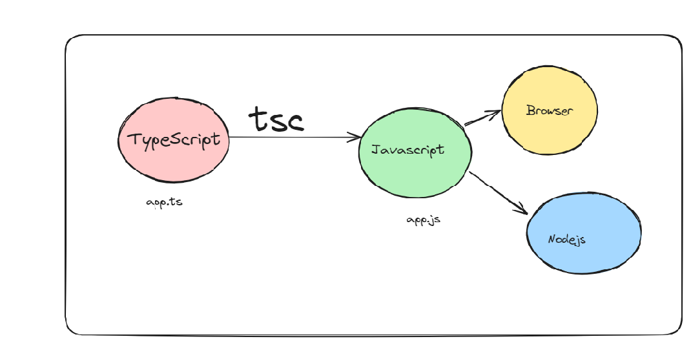

# Class Recording

1. [TypeScript-basic](https://youtu.be/HVmwU7O0nVY)

2. [TypeScript-revision](https://youtu.be/vtUM8ZYXRZU)

## Types of languages

**Strongly typed vs loosely typed**

- The terms `strongly typed` and `loosely typed` refer to how programming languages handle types, particularly how strict they are about type conversions and type safety.

`Strongly typed languages`

Examples - Java, C++, C, Rust

`Benefits - `

- Lesser runtime errors
- Stricter codebase
- Easy to catch errors at compile time

`Code doesnot work`

```c++

#include <iostream>

int main() {
  int number = 10;
  number = "text";
  return 0;
}

```

**Loosely typed languages**

Examples - Python, Javascript, Perl, php

`Benefits`

- Easy to write code
- Fast to bootstrap
- Low learning curve

`code run with no error`

```js
function app() {
  let number = 10;
  number = "text";
  return number;
}
```

## What is Typescript ?

TypeScript is a programming language developed and maintained by Microsoft.
It is a strict `syntactical superset` of JavaScript and adds optional static typing to the language.

**Where/How does typescript code run?**

`Typescript code never runs in your browser`. Your browser can only understand javascript.

1. Javascript is the runtime language (the thing that actually runs in your browser/nodejs runtime)
2. Typescript is something that compiles down to javascript
3. When typescript is compiled down to javascript, you get type checking (similar to C++). If there is an error, the conversion to Javascript fails.



**Typescript compiler**

`tsc` is the official typescript compiler that you can use to convert Typescript code into Javascript
There are many other famous compilers/transpilers for converting Typescript to Javascript. Some famous ones are -

- esbuild
- swc

## Install typescript globally and bootstarp typescipt nodejs project

`npm install -g typescript`

```js
mkdir ts-app
cd ts-app
npm init -y
npx tsc --init

```

`create a app.ts file`

```js
const x: number = 1;
console.log(x);

// const x: number = "This is string";
// console.log(x);
```

`Compile the ts file to js file`

```js
tsc -b
node app.js
```

- It will give your app.js file now, run the file in nodejs

## Basic Types in TypeScript

In TypeScript, there are several basic types that you can use to define variables. These basic types include `number, string, boolean, null, undefined, and void`. Let's go through each of them with examples:

`number:` Represents both integer and floating-point numbers.

```js
let age: number = 25;
let height: number = 5.11;
```

`string:` Represents textual data.

```js
let name: string = "John Doe";
let message: string = `Hello, ${name}!`;
```

`boolean:` Represents a logical value, either true or false.

```js
let isStudent: boolean = true;
let isLoggedIn: boolean = false;
```

`null and undefined:` These types have only one value each: null and undefined, respectively.

```js
let myVar: null = null;
let anotherVar: undefined = undefined;

let x: number | null = null; // Union type allowing either a number or null
let y: number | undefined = undefined; // Union type allowing either a number or undefined
```

`void:` Represents the absence of any type. It's typically used as the return type of functions that do not return a value.

```js
function greet(): void {
  console.log("Hello!");
}
```

1. Problem 1 - Hello world

**💡 Thing to learn - How to give types to the arguments of a function**

`Write a function that greets a user given their first name.`
Argument - firstName
Logs - Hello {firstName}
Doesn’t return anything
💡

```js
function greet(firstName: string) {
  console.log("Hello " + firstName);
}

greet("Robert Welker");
```

Problem 2 - Sum function

**💡 Things to learn - How to assign a return type to a function**

Write a function that calculates the sum of two functions

```js
function sum(a: number, b: number): number {
  return a + b;
}

console.log(sum(2, 3));
```

`type inference`

**Type inference is a feature in programming languages where the compiler or interpreter can automatically deduce the data type of a variable or expression without the programmer explicitly specifying it. This feature is particularly common in statically-typed languages, where data types are checked at compile time, but it can also be found in dynamically-typed languages.**

Problem 3 - Return true or false based on if a user is 18+
**💡 Thing to learn - Type inference**

Function name - isLegal

```js
function isLegal(age: number) {
  if (age > 18) {
    return true;
  } else {
    return false;
  }
}

console.log(isLegal(2));
```

**how to give type to a function that has been passed as an argument to another function**

Problem 4 -
Create a function that takes another function as input, and runs it after 1 second.

```js
function delayedCall(fn: () => void) {
  setTimeout(fn, 1000);
}

delayedCall(function () {
  console.log("hi there");
});
```

## understanding some important configurations from tsconfig file

The `tsconfig` file has a bunch of options that you can change to change the compilation process.
Some of these include

target, rootDir, outDir, noImplicitAny, removeComments

1. target

- The `target` option in a tsconfig.json file specifies the ECMAScript target version to which the TypeScript compiler will compile the TypeScript code.

To try it out, try compiling the following code for target being `ES5` and `es2020`

`const greet = (name: string) => `Hello, ${name}!`;`

2. rootDir

- Where should the compiler look for .ts files. Good practise is for this to be the src folder.

3. outDir

- Where should the compiler look for spit out the .js files.

## Understanding interfaces

1. What are interfaces

How can you assign types to objects? For example, a user object that looks like this -

```js
const user = {
	firstName: "Robert",
	lastName: "Welker",
	email: "robert@gmail.com".
	age: 62,
}

interface User {
	firstName: string;
	lastName: string;
	email: string;
	age: number;
}

```

Assignment #1 - Create a function isLegal that returns true or false if a user is above 18. It takes a user as an input.

```js
interface User {
  firstName: string;
  lastName: string;
  email: string;
  age: number;
}

function isLegal(user: User) {
  if (user.age > 18) {
    return true;
  } else {
    return false;
  }
}
```

Assignment #2 - Create a React component that takes todos as an input and renders them

## Creating a Nextjs component using typescript

```js
// Todo.tsx
interface TodoType {
  title: string;
  description: string;
  done: boolean;
}

interface TodoInput {
  todo: TodoType;
}

function Todo({ todo }: TodoInput) {
  return (
    <div>
      <h1>{todo.title}</h1>
      <h2>{todo.description}</h2>
    </div>
  );
}
```

## types

What are types?
Very similar to `interfaces` , types let you `aggregate` data together.

```js
type User = {
  firstName: string,
  lastName: string,
  age: number,
};
```

But they let you do a few other things.

1. Unions

Let’s say you want to print the id of a user, which can be a number or a string.

`You can not do this using interfaces`

```js
type StringOrNumber = string | number;

function printId(id: StringOrNumber) {
  console.log(`ID: ${id}`);
}

printId(101); // ID: 101
printId("202"); // ID: 202
```

2. Intersection

What if you want to create a type that has every property of multiple types/ interfaces

`You can not do this using interfaces`

```js
type Employee = {
  name: string,
  startDate: Date,
};

type Manager = {
  name: string,
  department: string,
};

type TeamLead = Employee & Manager;

const teamLead: TeamLead = {
  name: "Robert Welker",
  startDate: new Date(),
  department: "Software developer",
};
```

## arrays in typescript

If you want to access arrays in typescript, it’s as simple as adding a `[]` annotation next to the type

**Example 1**
Given an array of positive integers as input, return the maximum value in the array

```js
function maxValue(arr: number[]) {
  let max = 0;
  for (let i = 0; i < arr.length; i++) {
    if (arr[i] > max) {
      max = arr[i];
    }
  }
  return max;
}

console.log(maxValue([1, 2, 3]));
```

**Example 2**

Given a list of users, filter out the users that are legal (greater than 18 years of age)

```js
interface User {
  firstName: string;
  lastName: string;
  age: number;
}

function filteredUsers(users: User[]) {
  return users.filter((x) => x.age >= 18);
}

console.log(
  filteredUsers([
    {
      firstName: "Robert",
      lastName: "SWelker",
      age: 21,
    },
    {
      firstName: "Tucker",
      lastName: "Hoke",
      age: 16,
    },
  ])
);
```

## Exporting and importing modules

TypeScript follows the ES6 module system, using import and export statements to share code between different files. Here's a brief overview of how this works:

`math.ts`

```js
export function add(x: number, y: number): number {
  return x + y;
}

export function subtract(x: number, y: number): number {
  return x - y;
}
```

`main.ts`

```js
import { add } from "./math";

add(1, 2);
```

**Default exports**

```js
export default function add(x: number, y: number): number {
  return x + y;
}
```

`add.ts`

```js
import add from "./add";

console.log(add(10, 5));
```
