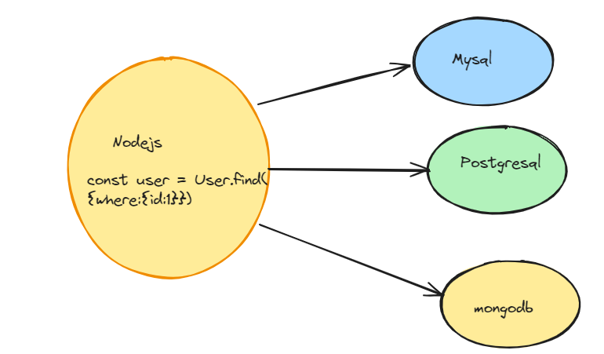
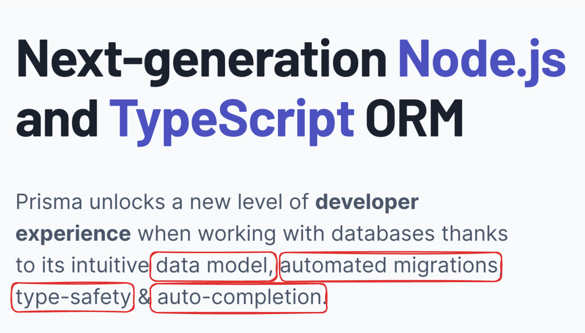

# Database

## Class Recording

1. [Database class 1](https://youtu.be/dwVAs2ysdM4)

2. [Database class 2-postgres](https://youtu.be/YAPGckP0px8)

## What is a database?

- Learning objectives
1.  understand the ACID properties of database.
2.  unserstand the difference between relational and non-relational database.


A database is a structured collection of data that is organized in such a way that it can be easily accessed, managed, and updated. It acts as a centralized repository for storing and retrieving information. Databases are used in a wide range of applications, from simple tasks like storing contact information to complex systems like managing large-scale business operations.

In a database, data is typically organized into tables, which consist of rows and columns. Each row represents a single record or entry, while each column represents a specific attribute or field of the data.

Databases are crucial for businesses, organizations, and applications to efficiently store, retrieve, and manipulate data. They come in various types, including relational databases (like MySQL, PostgreSQL, and Oracle), NoSQL databases (such as MongoDB and Cassandra), and others tailored to specific needs and use cases.


## STEP-1  Types of database

- What all we’ll learn today -
- Simple - SQL vs NoSQL, how to create Postgres Databases, How to do CRUD on them
- Advance - Relationships, Joins, Transactions

- There are a few types of databases, all service different types of use-cases

**NoSQL databases**

1. Store data in a `schema-less` fashion. Extremely lean and fast way to store data. 

2. Example - MongoDB.

**Graph databases**

1. Data is stored in the form of a graph. Specially useful in cases where `relationships` need to be stored (social networks)

2. Examples - Neo4j
 
 **Vector databases**

 1. Stores data in the form of vectors
 2. Useful in Machine learning
 3. Examples - Pinecone

 **SQL databases**

1. Stores data in the form of rows
2. Most full stack applications will use this
3. Examples - MySQL, Postgres


**What is a relational DBMS?**

A relational DBMS is a database management system (DBMS) that stores data in the form of relations or tables. This data can be accessed by the user through the use of SQL, which is a standard database query language.
What is relational DBMS explain with example?

A relational database management system (RDBMS) is a database management system (DBMS) that is based on the relational model as introduced by E. F. Codd. Examples of relational database management systems include Oracle, IBM DB2, Microsoft SQL Server, MySQL, and PostgreSQL.

## Step 2 - Why not NoSQL

You might’ve used MongoDB 
It’s schemaless properties make it ideal to for bootstraping a project fast.
But as your app grows, this property makes it very easy for data to get curropted

**What is schemaless?**

Different rows can have different schema (keys/types)

**Problems?**
1. Can lead to inconsistent database
2. Can cause runtime errors 
3. Is too flexible for an app that needs strictness
 
**Upsides?**
1. Can move very fast
2. Can change schema very easily


## Step 3 - Why SQL?

**SQL databases have a strict schema. They require you to**

1. Define your schema
2. Put in data that follows that schema
3. Update the schema as your app changes and perform migrations
 
**So there are 4 parts when using an SQL database.**

1. Running the database.
2. Using a library that let’s you connect and put data in it.
3. Creating a table and defining it’s schema.
4. Run queries on the database to interact with the data (Find/Insert/Update/Delete)


### Resourses for installation and practice.

1. The Odin Project -

[Odin Project - DATABASE COURSE](https://www.theodinproject.com/paths/full-stack-ruby-on-rails/courses/databases)

 
## STEP - 4 installation

**Install PostgreSQL**

[Install PostgreSQL](https://database.guide/what-do-i-need-to-run-sql/)


[PostgresSQL Tutorial](https://www.postgresql.org/docs/current/tutorial-install.html)


**ACID**

[ACID Definition](https://database.guide/what-is-acid-in-databases/)

**What is NoSQL database**

[NoSQL Database](https://aws.amazon.com/nosql/)


## Step 5 - Using a library that let’s you connect and put data in it.

1. psql
psql is a terminal-based front-end to PostgreSQL. It provides an interactive command-line interface to the PostgreSQL (or TimescaleDB) database. With psql, you can type in queries interactively, issue them to PostgreSQL, and see the query results.

2. pg

pg is a Node.js library that you can use in your backend app to store data in the Postgres DB (similar to mongoose). We will be installing this eventually in our app.


## Why is SQL important?
SQL is important because it is how you interact directly with databases. Yes, you might be able to work with databases through libraries and not use or write any SQL, but knowing what is happening underneath will prove to be an invaluable asset.

## Step 6  - Creating a table and defining it’s schema.

**Table in SQL**

A single database can have multiple tables inside. 
Think of them as collections in a MongoDB database.
`SQL` stands for `Structured query language`. It is a language in which you can describe what/how you want to put data in the database.
To create a table, the command to run is - 


**What is a database schema?**

A database schema defines how data is organized within a relational database; this is inclusive of logical constraints such as, table names, fields, data types and the relationships between these entities.

```js
CREATE TABLE users (
    id SERIAL PRIMARY KEY,
    username VARCHAR(50) UNIQUE NOT NULL,
    email VARCHAR(255) UNIQUE NOT NULL,
    password VARCHAR(255) NOT NULL,
    created_at TIMESTAMP WITH TIME ZONE DEFAULT CURRENT_TIMESTAMP
);

```

There are a few parts of this SQL statement, let’s decode them one by one

1. CREATE TABLE users

`CREATE TABLE users:` This command initiates the creation of a new table in the database named `users`.

2. id SERIAL PRIMARY KEY

- `id:` The name of the first column in the users table, typically used as a unique identifier for each row (user). Similar to _id in mongodb
- `SERIAL:` A PostgreSQL-specific data type for creating an auto-incrementing integer. Every time a new row is inserted, this value automatically increments, ensuring each user has a unique id.
- `PRIMARY KEY:` This constraint specifies that the id column is the primary key for the table, meaning it uniquely identifies each row. Values in this column must be unique and not null.

3.  email VARCHAR(255) UNIQUE NOT NULL,
- `email:` The name of the second column, intended to store the user's username.
- `VARCHAR(50):` A variable character string data type that can store up to 50 characters. It's used here to limit the length of the username.
- `UNIQUE:` This constraint ensures that all values in the username column are unique across the table. No two users can have the same username.
- `NOT NULL:` This constraint prevents null values from being inserted into the username column. Every row must have a username value.

4. password VARCHAR(255) NOT NUL

Same as above, can be non uniqye

5. created_at TIMESTAMP WITH TIME ZONE DEFAULT CURRENT_TIMESTAMP

- `created_at:` The name of the fifth column, intended to store the timestamp when the user was created.
- `TIMESTAMP WITH TIME ZONE:` This data type stores both a timestamp and a time zone, allowing for the precise tracking of when an event occurred, regardless of the user's or server's time zone.
- `DEFAULT CURRENT_TIMESTAMP:` This default value automatically sets the created_at column to the date and time at which the row is inserted into the table, using the current timestamp of the database server.

## Step 7 - Interacting with the database

`There are 4 things you’d like to do with a database`

1. `INSERT`

```js
INSERT INTO users (username, email, password)
VALUES ('username_here', 'user@example.com', 'user_password');
```

`Notice how you didn’t have to specify the id  because it auto increments`

2. UPDATE

```js

UPDATE users
SET password = 'new_password'
WHERE email = 'user@example.com';
```

3. DELETE

```js
DELETE FROM users
WHERE id = 1;
```

4. Select

```js
SELECT * FROM users
WHERE id = 1;
```

# Prisma (ORM)

 **Step 1 - What are ORMs**

`Defination`


- ORM stands for Object-Relational Mapping, a programming technique used in software development to convert data between incompatible type systems in object-oriented programming languages. This technique creates a "virtual object database" that can be used from within the programming language.

- ORMs are used to abstract the complexities of the underlying database into simpler, more easily managed objects within the code

`Let's understand in easy way`

- ORMs let you easily interact with your database without worrying too much about the underlying syntax (SQL language for eg)

**Step 2 - Why ORMs?**

1. Simpler syntax (converts objects to SQL queries under the hood)

```js
// no ORM
const query = SELECT * FROM users WHERE email = 'dev@gmail.com'

//ORM

const user = User.find({
    where:{email:'dev@gmail.com'}
})

```

2. Unified API irrespective of the Database.

- Imagine you have a magic tool that lets you easily switch between different databases without much trouble. And no matter which database you're using, you can still use the same commands to talk to it. It's like having a universal remote control for your databases!




3. Type safety/Auto completion

```js
// Define the User table schema
model User {
  id        Int      @id @default(autoincrement())
  username  String   @unique
  email     String   @unique
  password  String
  createdAt DateTime @default(now())
  updatedAt DateTime @updatedAt
}

//

import { PrismaClient } from '@prisma/client';

const prisma = new PrismaClient();

async function createUser(username: string, email: string, password: string) {
  const newUser = await prisma.user.create({
    data: {
      username,
      email,
      password,
    },
  });
  return newUser;
}

async function findUserById(id: number) {
  const user = await prisma.user.findUnique({
    where: {
      id,
    },
  });
  return user;
}

// Usage

createUser('john_doe', 'john@example.com', 'password123')
  .then((user) => {
    console.log('Created user:', user);
  })
  .catch((error) => {
    console.error('Error creating user:', error);
  });

findUserById(1)
  .then((user) => {
    console.log('Found user by id:', user);
  })
  .catch((error) => {
    console.error('Error finding user by id:', error);
  });

```
 

 4. Automatic migrations

 - Automatic migrations refer to the process where a database schema is automatically updated to match changes made in the application code without requiring manual intervention. Prisma, being an ORM (Object-Relational Mapping) tool, excels in handling automatic migrations.

 `Here's how it works and why it's beneficial:`

- Schema Synchronization: When you define your database schema using Prisma's schema language (as shown in the example I provided earlier), Prisma uses this schema definition as the single source of truth for your application's database structure.

- Tracking Changes: As you make changes to your Prisma schema (adding new models, fields, or modifying existing ones), Prisma tracks these changes and generates migration files automatically.

- Migration Execution: When you run a command to deploy these changes (for instance, prisma migrate dev), Prisma automatically applies these migrations to your database, updating its structure to match the new schema.

- Safety and Consistency: Automatic migrations ensure that your application's database structure is always in sync with your codebase, reducing the likelihood of errors due to schema inconsistencies. This is especially important in collaborative environments or when deploying changes across different environments (development, staging, production).

- Ease of Development: By automating the migration process, Prisma eliminates the need for developers to write manual SQL migration scripts, saving time and reducing the potential for human error.

- Version Control Integration: Since Prisma generates migration files as part of your codebase, these files can be version-controlled along with your application code, providing a complete history of database schema changes and facilitating collaboration among team members.

- Overall, Prisma's support for automatic migrations simplifies the database management process, making it more efficient and less error-prone compared to manually writing and executing migration scripts. It allows developers to focus more on building features and less on managing database changes.


**Step 3 - What is Prisma**



1. Data model
In a single file, define your schema. What it looks like, what tables you have, what field each table has, how are rows related to each other.
2. Automated migrations
Prisma generates and runs database migrations based on changes to the Prisma schema. 
3. Type Safety
Prisma generates a type-safe database client based on the Prisma schema.

4. Auto-Completion
Prisma give you auto completion of code which make easy to write code.

**Installation of prisma**
- npm install prisma
- npx prisma init

- change the review the primsa folder and .env file

- make change to the prisma.config file for your database

- add the database connection string in your .env file

- add schema for your table

- run npx prisma migrate dev
- npx prisma generate
- npx prisma db push
- npx prisma studio 

**Best practice for instantiating Prisma Client with Next.js**

- create client.ts file in prisma folder. and insert below code.

```js
import { PrismaClient } from '@prisma/client'

const prismaClientSingleton = () => {
  return new PrismaClient()
}

declare global {
  var prismaGlobal: undefined | ReturnType<typeof prismaClientSingleton>
}

const prisma = globalThis.prismaGlobal ?? prismaClientSingleton()

export default prisma

if (process.env.NODE_ENV !== 'production') globalThis.prismaGlobal = prisma

```

**Assignment**

- create schema for user and todo
- crate api to do curd operation
- use postman as fontend application to perform the CRUD operation.
```js

// This is your Prisma schema file,
// learn more about it in the docs: https://pris.ly/d/prisma-schema

generator client {
  provider = "prisma-client-js"
}

datasource db {
  provider = "postgresql"
  url      = env("DATABASE_URL")
}

model User {
  id         Int      @id @default(autoincrement())
  username   String   @unique
  password   String
  firstName  String
  lastName   String
}

model Todo {
  id          Int     @id @default(autoincrement())
  title       String
  description String
  done        Boolean @default(false)
  userId      Int
}


```

