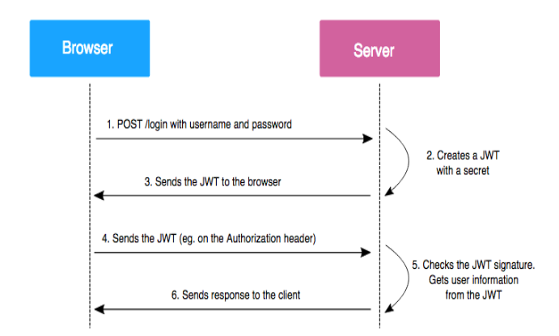

# Class Recording

1. [Auth class -1](https://youtu.be/V9OYR0DCd18)

1. [Auth(nextauth) class -2](https://youtu.be/JIXbfX0aySg)

# What is authentication?

- Authentication is the process of letting users signup/signin into websites via `username` / `password` or using `SSO` (single sign on)

## What are cookies

Cookies in web development are small pieces of data sent from a website and stored on the user's computer by the user's web browser while the user is browsing. They are designed to be a reliable mechanism for websites to remember things (very similar to local storage)

1. `Session Management:` Cookies allow websites to identify users and track their individual session states across multiple pages or visits.

2. `Personalization:` Websites use cookies to personalize content and ads. For instance, cookies might store information about a user's preferences, allowing the site to tailor content or advertisements to those interests.

3. `Tracking:` Cookies can track users across websites, providing insights into browsing behavior. This information can be used for analytics purposes, to improve website functionality, or for advertising targeting.

4. `Security:` Secure cookies can be used to enhance the security of a website by ensuring that the transmission of information is only done over an encrypted connection, helping to prevent unauthorized access to user data.

# Authentication using jwt

What are JSON Web Tokens (JWT)?

JSON Web Tokens (JWT) is an open standard (RFC 7519) for securely representing claims between two parties. The parties can be a server and a client, or different servers. JWTs are digitally signed, compact, and self-contained, making them ideal for transmitting information securely between parties.

JWTs consist of three parts separated by periods: the header, payload, and signature. The header contains information about the algorithm used for signing the token, the payload contains claims (information), and the signature ensures the integrity of the token.

`json web token - jwt`
json -
web -
token -

- jwt just convert user information into long string.

**JWT Workflow for User Authentication**

- signup (fill the form, email, password) - user data will be stored in database
- signin (email, password) - if email and password matched, then signin is success

1. check if password is correct
2. check if user is verified

- server will return jwt_token and stored in borwser cookies.

**User Login**



- When a user attempts to log in, the server verifies the provided credentials.
- If the credentials are valid, the server generates a JWT containing user-specific data and signs it with a secret key.
- The server sends the JWT back to the client

**Client Requests**

- The server validates the JWT, ensuring its authenticity and integrity, and authorizes the user for specific resources or actions.

**Implementing User Authentication and Authorization with Node.js and Express.**

`Step 1: Set Up the Project`

- Create a new directory and initialize a Node.js project:(auth-jwt)

- initialize the project - `npm init -y`

`Step 2: Install Dependencies`

`npm install express jsonwebtoken bcrypt mongoose nodemon`

`Step 3: Create the Server`

- Create an app.js file and set up the basic Express server:
  app.js

```js
// app.js


const express = require('express');

const app = express();


// Set up middleware to parse JSON data

app.use(express.json());


// Start the server

const port = process.env.PORT || 3000;

app.listen(port, () => {

  console.log(`Server started on port ${port}`);

});

```

`Step 4: Set Up MongoDB Connection`

- Create a separate db.js file to establish a connection to the MongoDB database:

```js
// db.js


const mongoose = require('mongoose');

mongoose.connect('mongoose connection string')

.then(() => {

 console.log('Connected to MongoDB');

})

.catch((err) => {

 console.error('Error connecting to MongoDB:', err.message);

});

```

`Step 5: Create a User Model`

- Create a models/user.js file to define the User schema and model for MongoDB:

```js
// models/user.js
const mongoose = require('mongoose');


const userSchema = new mongoose.Schema({

 email: { type: String, required: true, unique: true },

 password: { type: String, required: true },

});


const User = mongoose.model('User', userSchema);


module.exports = User;
```

`Step 6: Implement User Registration`

- In the app.js file, add the route to handle user registration:

```js
// app.js
const bcrypt = require('bcryptjs');
require('./db');

const User = require('./models/user');

 

// Route for user registration

app.post('/register', async (req, res) => {

  try {

    const { email, password } = req.body;

 

    // Check if the user already exists

    const existingUser = await User.findOne({ email });

    if (existingUser) {

      return res.status(400).json({ error: 'User already exists' });

    }

 

    // Hash the password using bcrypt

    const hashedPassword = await bcrypt.hash(password, 10);

 

    // Create a new user in the database

    const newUser = new User({

      email,

      password: hashedPassword,

    });

 

    await newUser.save();

    return res.status(201).json({ message: 'User registered successfully' });

  } catch (err) {

    return res.status(500).json({ error: 'Internal server error' });

  }

});

```

`Step 7: Implement User Login and JWT Generation`

- In the same app.js file, add the route for user login and JWT generation:

```js
const jwt = require('jsonwebtoken');

const secretKey = 'some$secrectcode123#'; // Replace this with a strong and secure key

 

// Route for user login

app.post('/login', async (req, res) => {

  try {

    const { email, password } = req.body;

 

    // Check if the user exists in the database

    const user = await User.findOne({ email });

    if (!user) {

      return res.status(401).json({ error: 'Invalid credentials'});

    }

// Compare the provided password with the hashed password using bcrypt

    const passwordMatch = await bcrypt.compare(password, user.password);

    if (!passwordMatch) {

      return res.status(401).json({ error: 'Invalid credentials' });

    }

    // Generate a JWT for the authenticated user

    const token = jwt.sign({ userId: user._id, email: user.email }, secretKey, {

      expiresIn: '1h', // Token will expire in 1 hour

    });

 

    return res.status(200).json({ token });

  } catch (err) {

    return res.status(500).json({ error: 'Internal server error' });

  }

});

```

`Step 8: Secure Routes with JWT Authentication Middleware`

- Now, we will implement a middleware function to authenticate and authorize requests before accessing protected routes:

```js
// app.js

 

// Middleware to authenticate and authorize requests

const authenticateUser = (req, res, next) => {
  try {
    // Extract the token from the Authorization header

    const token = req.header("Authorization").split(" ")[1];
    console.log(token)

    // Verify the token using the secret key
    if (token) {
      let user = jwt.verify(token, secretKey);
      console.log(user)

      // Attach the user ID and email to the request object for further processing
      req.userId = user.userId;

      req.email = user.email;
    } else {
      res.status(401).json({ message: "Unauthorized User" });
    }

    next();
  } catch (err) {
    return res.status(401).json({ error: "Invalid or expired token" });
  }
};


 

// Protected route example

app.get('/protected', authenticateUser, (req, res) => {

  return res.status(200).json({ message: 'You have access to this protected route' });

});

```

# Next Auth

- Website authjs -  [Auth.js](https://authjs.dev/getting-started)

Setp1: `Install nextjs project and configure prettier and eslint step2 and step 3`

Step2: `npm install -D prettier eslint-config-prettier prettier-plugin-tailwindcss`

Step3: `create prettier.config.ts file in root of the project and add below code next update the .eslintrc.json`

```js
//prettier.config.ts

module.exports = {
    "plugins": [require("prettier-plugin-tailwindcss")]
}

// .eslintrc.json

{
  "extends": ["next/core-web-vitals", "prettier"]
}


```
- From authjs website follow the instruction to setup the nextauth.

Step 4: `npm install next-auth@beta`

- add .env.local file and `npx auth secret`
`AUTH_SECRET=qbSSVh5jLqEUwFPJ3wttACm6owwEO3oAbhuVW5EQLQY=`

- follow the steps in authjs website.

Step - 5: `setup prisma to manage database, create schema and push the database schema`
- `npm i prisma`
- `npx prisma init`
`npm install @prisma/client @auth/prisma-adapter`
- Add prisma client
- create schema
- `npm exec prisma migrate dev`
- `npx prisma db push`
- `npx prisma studio`

We completed the setting up prisma.

Step-6 : 
- import PrismaAdapter in auth.ts
 `import { PrismaAdapter } from "@auth/prisma-adapter"`

 ```js
import NextAuth from "next-auth"
import { PrismaAdapter } from "@auth/prisma-adapter"
import prisma from '@prisma/client'
 
export const { handlers, auth, signIn, signOut } = NextAuth({
  adapter: PrismaAdapter(prisma),
  providers: [],
})

 ```
- SessionWrapper.tsx

```js
"use client";
import { SessionProvider } from "next-auth/react";

import React from "react";

const SessionWrapper = ({ children }: { children: React.ReactNode }) => {
  return <SessionProvider>{children}</SessionProvider>;
};

export default SessionWrapper

```


