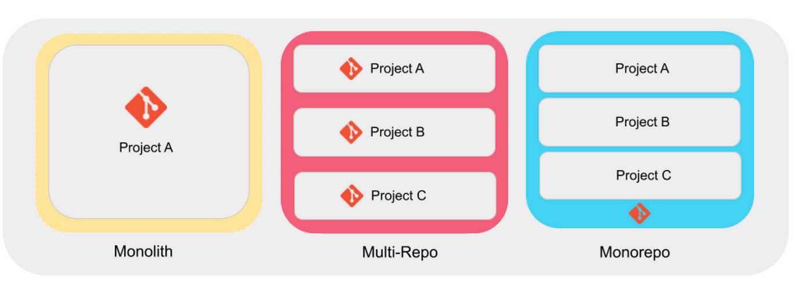
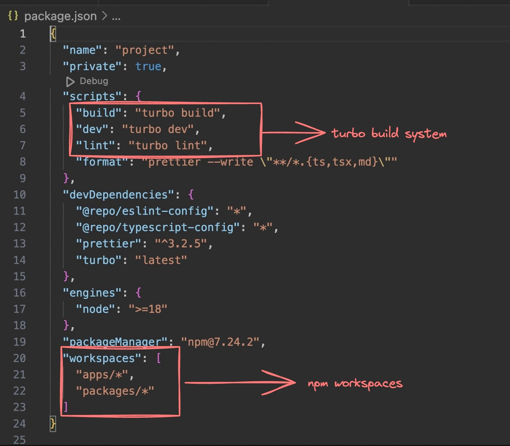

# Turborepo and Monorepos

### Video

[Turborepo Tutorial - a monorepo by Vercel](https://www.youtube.com/watch?v=d5De8rvFylQ)

[Turborepo and Monorepos- 1](https://youtu.be/xd51tHDzIno)

## What are monorepos

As the name suggests, a single repository (on github lets say) that holds all your frontend, backend, devops code

A "monorepo" (short for "monolithic repository") is a software development strategy where multiple projects or components are stored in a single, centralized repository. Instead of having separate repositories for each project, all the code, libraries, tools, and configuration files are managed together in one place.

Advantages:

- Shared Code: Easy to share and reuse code across different projects.
- Consistency: Easier to maintain consistent tools, configurations, and dependencies.
- Atomic Changes: You can make changes across multiple projects simultaneously, ensuring compatibility.

Disadvantages:

- Complexity: Managing a large repository can become complex as it grows.
- Tooling: Requires specialized tools to manage the dependencies and builds for multiple projects efficiently.

Monorepos are popular in large organizations where multiple teams work on interconnected projects, such as Google, Facebook, and Microsoft.

[Example - cal.com](https://github.com/calcom/cal.com)

`Do you need to know them very well as a full stack engineer`

Not exactly. Most of the times they are setup in the project already by the dev tools guy and you just need to follow the right practises
Good to know how to set one up from scratch though

## Why Monorepos?

Why not Simple folders?

Why cant I just store services (backend, frontend etc) in various top level folders?

- You can, and you should if your
- Services are highly decoupled (dont share any code)
- Services don’t depend on each other.



## Common monorepo framework in Node.js

- Lerna - https://lerna.js.org/

- nx - https://github.com/nrwl/nx

- Yarn/npm workspaces - https://classic.yarnpkg.com/lang/en/docs/workspaces/

- Turborepo - https://turbo.build/ — Not exactly a monorepo framework

We'll be covering Turborepo, as it is the most relevant option today, offering features like build optimizations that other tools may not provide.

## Build system vs Build system orchestrator vs Monorepo framework

[Turborepo](./images/Screenshot_turbo.png)

`Build System:`
A build system automates transforming source code into executable binary code. For JavaScript and TypeScript projects, this includes tasks like transpilation (TS to JS), bundling, minification, testing, linting, and deployment.

`Build System Orchestrator:`
Turborepo acts as a build system orchestrator. It doesn't directly handle tasks like transpilation or bundling but instead manages and coordinates tools within a monorepo to perform these actions, such as tsc or vite.

`Monorepo Framework:`
A monorepo framework provides tools and conventions for managing multiple packages or applications within a single repository, including dependency management and workspace configuration.

### Turborepo as a Build System Orchestrator:

`Turborepo manages and optimizes task execution in your monorepo through:`

- Caching: Reuses task outputs to skip redundant executions, speeding up builds.
- Parallelization: Runs independent tasks simultaneously, maximizing resource efficiency.
- Dependency Graph Awareness: Understands package dependencies to ensure tasks run in the correct order.

## Let’s initialize a simple Turborepo

[Turborepo- ref](https://turbo.build/repo/docs)

```ts
npx create-turbo@latest
```

## Explore the folder structure

There are 5 modules in our project

`End user apps (websites/core backend)`
apps/web - A Next.js website
apps/docs - A Docs website that has all the documentation related to your project

`Helper packages`
packages/ui - UI packages
packages/typescript-config - Shareable TS configuration
packages/eslint-config - Shareable ESLine configuration

## Let’s try to run the project

```ts
npm run dev
```

You will notice two websites running on
localhost:3000
localhost:3001

This means we have a single repo which has multiple projects which share code from packages/ui

## Exploring root package.json



`scripts`
This represents what command runs when you run
npm run build
npm run dev
npm run lint

turbo build goes into all packages and apps and runs npm run build inside them (provided they have it)
Same for dev and lint

## Exploring packages/ui

## Exploring apps/web

## Let’s add a new page

- Try adding a new page to /admin to the apps/web next.js website.
- It should use a simple Admin component from packages/ui

Steps to follow -

- Create a new file admin.tsx inside packages/ui/src
- Export a simple React component

```ts
"use client";

export const Admin = () => {
  return <h1>This is Admin component</h1>;
};
```

- Add the component to exports in packages/ui/package.json
- Create apps/web/app/admin/page.tsx
- Export a default component that uses the @repo/ui/admin component
- Run npm run dev (either in root or in apps/web ) and try to see the website

- You can also use the packages/ui/turbo/generators to quickly bootstrap a new component
- Try running npx gen react-component and notice it’ll do step 1, 2, 3 for you in one cli call

## Exploring turbo.json


Ref - https://turbo.build/repo/docs/getting-started/create-new#3-understanding-turbojson
References - https://turbo.build/repo/docs/reference/configuration#globaldependencies

## Adding React projects

1. Go to the apps folder

`cd app`

2. Create a fresh vite app

`npm create vite@latest `

3. Update package.json to include @repo/ui as a dependency

`"@repo/ui": "*",`

4. Run npm install in the root folder (back to root folder and )

`npm install`

5. Run npm run dev

6. Try importing something from the ui package and rendering it

7. Add a turbo.json to the react folder to override the outputs object of this module.
   Ref https://turbo.build/repo/docs/core-concepts/monorepos/configuring-workspaces

```ts
{
  "extends": ["//"],
  "pipeline": {
    "build": {
      "outputs": ["dist/**"]
    }
  }
}

```

## Adding a Node.js app

1. Create apps/backend
2. Initialize empty ts repo

```ts
npm init -y
npx tsc --init
```

1. Use base tsconfig (Ref - https://github.com/vercel/turbo/blob/main/examples/kitchen-sink/apps/api/tsconfig.json )

```ts
{
  "extends": "@repo/typescript-config/base.json",
  "compilerOptions": {
    "lib": ["ES2015"],
    "module": "CommonJS",
    "outDir": "./dist",
  },
  "exclude": ["node_modules"],
  "include": ["."]
}
```

1. Add dependencies

```ts
npm i express @types/express
```

1. Add src/index.ts

```ts
import express from "express";

const app = express();

app.get("/", (req, res) => {
  res.json({
    message: "hello world",
  });
});
```

1. Update turbo.json

```ts
{
  "extends": ["//"],
  "pipeline": {
    "build": {
      "outputs": ["dist/**"]
    }
  }
}
```

1. Install esbuild

```ts
npm install esbuild
```

1. Add build script to package.json

```ts
"build": "esbuild src/index.ts --platform=node --bundle --outdir=dist"
```

## Adding a common module

A lot of times you need a module that can be shared by both frontend and backend apps

1. Initialize a packages/common module

```ts
cd packages
mkdir common
```

1.  Initialize an empty node.js project

```ts
npm init -y
npx tsc --init
```

1. Change the name to @repo/common

2. Export a few things from src/index.ts

```ts
export const NUMBER = 1;
```

1. Add it to the package.json of various apps (next app/react app/node app)

```ts
"@repo/common": "*",
```

1. Import it in any projecct and try to use it.
2. Run npm install in root folder and see if it works as expected
