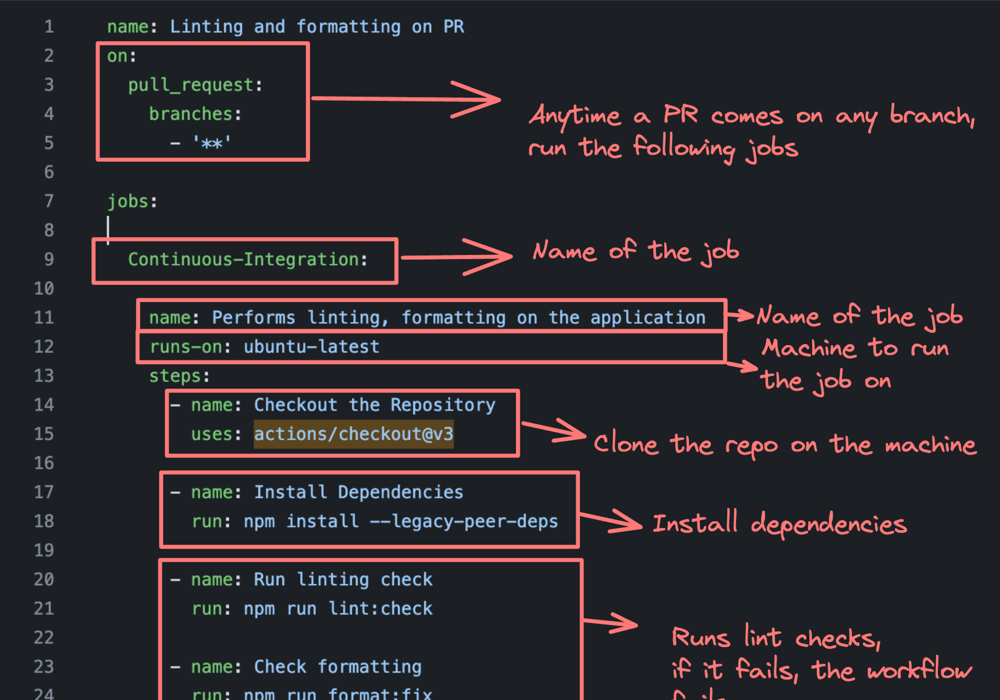

# CI and CD

## video

[CI-CD class 1](https://youtu.be/7qtDCSJRiRc)

## How to host next js app on GitHub pages using GitHub Actions | CI/CD

- create repo in github
- clone to your local machine
- add nextjs project
- make some changes to your project.
- when we are using app router, make change to your next.config.js

```ts
/** @type {import('next').NextConfig} */
const nextConfig = {
  output: "export",
};

module.exports = nextConfig;
```

- if you have any absolute path, in your project make sure to change to relative path.

```ts
//example
<Image src="./images/home.jpg" alt="homeimage" with={400} height={300}>
```

- git add .
- git commit -m "initial commit"
- git push

- go to your repo, setting, pages, change the sources to Github Actions

- click on configure button, it will give you readymade nextjs yml file.
- commit changes
- go to action, here u will see the deploy changes
- Its fully automated.

- setting, go to pages to get the live link.

### What is CI and CD?

`Continuous Integration`

-Continuous Integration (CI) is a development practice where developers frequently integrate their code changes into a shared repository, preferably several times a day. Each integration is automatically verified by

1. Building the project and

2. Running automated tests.

This process allows teams to detect problems early, improve software quality, and reduce the time it takes to validate and release new software updates.

`Continuous Deployment`

As the name suggests, deploying your code continuously to various environments (dev/stage/prod)

### CI/CD Architecture using Docker


- clone the repo
- Dockerize it
- Push it to the dockerhub
- Push it to the EC2 machine or any hosting

note: Last step keeps changing based on where you’re pushing your image

### How to create a CI/CD pipeline?



```ts
name: Linting and formatting on PR
on:
  pull_request:
    branches:
      - '**'

jobs:

  Continuous-Integration:

    name: Performs linting, formatting on the application
    runs-on: ubuntu-latest
    steps:
      - name: Checkout the Repository
        uses: actions/checkout@v3

      - name: Install Dependencies
        run: npm install --legacy-peer-deps

      - name: Run linting check
        run: npm run lint:check

      - name: Check formatting
        run: npm run format:check

```

CD pipelines look like this finally -


Hint - Use https://onlineyamltools.com/convert-yaml-to-json to see the pipeline in json

#### Step 1 - Create the CI pipeline

Make sure that whenever someone tries to create a PR, we build the project and make sure that it builds as expected


#### Lets add a build pipeline for our repo

Anytime a user creates a PR, we need to run npm run build and only if it succeeds should the workflow succeed

- Add .github/workflows/build.yml in the root folder
- Create the workflow

```ts
name: Build on PR

on:
  push:
    branches: [ "main" ]
  pull_request:
    branches: [ "main" ]

jobs:
  build:
    runs-on: ubuntu-latest

    strategy:
      matrix:
        node-version: [18.x, 20.x, 22.x]

    steps:
      - uses: actions/checkout@v4
      - name: Use Node.js
        uses: actions/setup-node@v4
        with:
        node-version: ${{ matrix.node-version }}
        cache: 'npm'

      - name: Install Dependencies
        run: npm install

      - name: Run Build
        run: npm run build

```

- Push this to master branch

- Create a new branch with some minimal changes and create a PR from it

- You should see the workflow run

[sample workflow](./images//Screenshot_5.png)

Remaining steps is

- Deploy to docker hub.
- Pull from docker hub to production server.
- once merge the branch to main - workflow should trigger.

```ts
//Dockerfile

# Use the official Node.js image as a base image
FROM node:20-alpine

# Set the working directory inside the container
WORKDIR /app

# Copy package.json and package-lock.json files
COPY package*.json ./

# Install dependencies
RUN npm install

# Copy the rest of the application code
COPY . .

# Build the Next.js application
RUN npm run build

# Expose the port the app runs on
EXPOSE 3000

# Command to start the application
CMD ["npm", "start"]

```

```ts
name: Deploy

on:
  push:
    branches: ["main"]

jobs:
  deploy:
    runs-on: ubuntu-latest

    steps:
      - uses: actions/checkout@v4
      - run: docker build . -t brham1980/next-js-app
      - run: echo "${{secrets.DOCKERHUB_PASSWORD}}" | docker login -u ${{secrets.DOCKERHUB_USERNAME}} --password-stdin
      - run: docker push brham1980/next-js-app:latest
```

### Final part is deploy to ec2 machine or any colud hosting, vps hosting.
